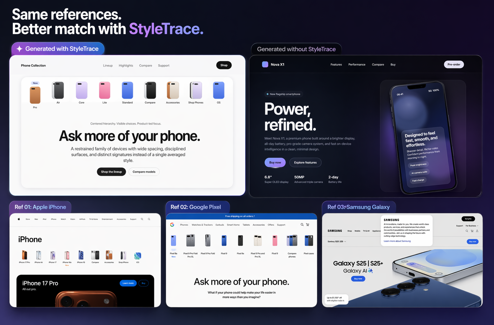
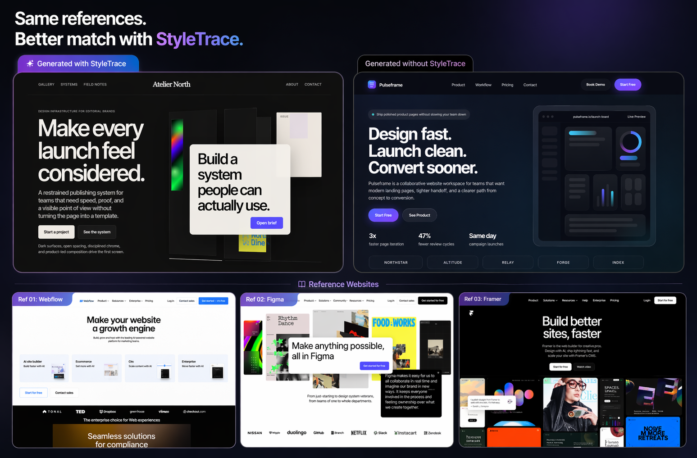

# StyleTrace

[English](README.md) | [繁體中文](README.zh-TW.md) | [日本語](README.ja.md) | 한국어 | [Français](README.fr.md) | [Español](README.es.md)


StyleTrace는 참조 대상을 분석하고 에이전트와 리뷰어를 위한 프롬프트 친화적인 디자인 브리프를 반환하는 MCP 서버입니다. 대표적인 사용 사례는 개발자가 디자인 결정에 덜 방해받으면서 웹사이트를 만들고, 그 뒤에 생성 결과를 원래 스타일 제약과 비교해 리뷰하는 것입니다.



같은 참조 세트를 사용해 리뷰 흐름에서 StyleTrace 사용 여부를 비교한 추가 예시입니다.



## 왜 사용하나요

- 몇 개의 참고 페이지, 스크린샷, HTML 스니펫을 에이전트가 실제로 사용할 수 있는 프롬프트용 디자인 브리프로 바꿉니다
- 눈에 띄는 특징을 유지해서 생성된 사이트가 너무 평범해지는 것을 줄여줍니다
- 추출된 스타일 제약에 맞춰 생성된 HTML 또는 스크린샷을 리뷰할 수 있어 모호한 시각적 판단에만 의존하지 않아도 됩니다
- 사용자가 준 참조만 분석하므로 결과가 예측 가능하고 검토하기 쉽습니다

## 설치

요구 사항:

- Node.js `>=20`
- Playwright Chromium

npm 설치:

```bash
npm install -g @agenticbridge/style-trace
npx playwright install chromium
```

로컬 클론에서 실행:

```bash
npm install
npx playwright install chromium
npm run build
```

## 사용법

MCP 클라이언트에서 연결해서 사용하세요.

배포된 패키지:

```json
{
  "mcpServers": {
    "style-trace": {
      "command": "npx",
      "args": ["-y", "@agenticbridge/style-trace"]
    }
  }
}
```

로컬 클론:

```json
{
  "mcpServers": {
    "style-trace": {
      "command": "node",
      "args": ["/absolute/path/to/style-trace/dist/src/index.js"]
    }
  }
}
```

서버는 두 가지 도구를 제공합니다.

- `analyze_website_style`
- `review_generated_style`

`analyze_website_style`는 정확한 웹사이트 URL을 입력으로 받을 수 있습니다.

```json
{
  "urls": ["https://www.apple.com", "https://www.framer.com"],
  "targetArtifact": "landing-page",
  "fidelity": "high"
}
```

혼합 참조도 받을 수 있습니다.

```json
{
  "references": [
    { "type": "url", "value": "https://www.apple.com/iphone/" },
    { "type": "image", "value": "https://example-cdn.com/reference/hero-shot.png" },
    { "type": "screenshot", "value": "https://example-cdn.com/reference/hero-capture.png" },
    { "type": "html", "value": "<main><section><h1>Hero</h1></section></main>" }
  ],
  "targetArtifact": "prototype",
  "fidelity": "medium",
  "designIntent": "preserve the hero hierarchy and chrome discipline",
  "evidenceMode": "inline"
}
```

`urls`는 웹사이트 전용 입력으로 계속 지원됩니다. 웹사이트, 이미지, 스크린샷, 경계가 있는 HTML 소스를 한 요청에서 섞고 싶다면 `references`를 사용하세요.

결과에는 `visualVocabulary`, `styleInvariants`, `styleRisks`, `softGuesses`, `compositionBlueprint`, `variationAxes`, `blendModes`, `promptReadyBrief`, `reviewContract`, `originalityBoundary` 같은 프롬프트용 필드가 포함됩니다.

`review_generated_style`는 생성된 HTML 또는 생성된 이미지 URL을 StyleTrace 결과와 대조합니다.

```json
{
  "styleResult": { "...": "StyleTrace analyze_website_style output" },
  "generatedHtml": "<!doctype html><html>...</html>",
  "viewportWidth": 1440,
  "viewportHeight": 900
}
```

어떤 제약이 맞았는지, 무엇을 위반했는지, 어디서 드리프트가 생겼는지, 그리고 전체 리뷰 신뢰도를 반환합니다.

## 작동 방식

`analyze_website_style`는 사용자가 제공한 공개 URL을 Playwright로 방문하고, 직접 공개된 이미지 URL, 스크린샷 참조, 경계가 있는 HTML 스니펫도 분석할 수 있습니다. 모듈 구조, hero 처리 방식, CTA 패턴, 사회적 증거 영역, 이미지, 폼, 브레이크포인트, 시그니처 모티프 같은 좁고 검토 가능한 신호를 추출한 뒤, 이를 하드 제약, 드리프트 위험, 구성 구조, 리뷰 체크를 포함한 프롬프트용 디자인 브리프로 정리합니다. 추가 페이지를 크롤링하지 않으며, 새로운 디자인 시스템을 임의로 만들거나 추측성 제안을 하지 않습니다.

`review_generated_style`는 생성된 결과물을 같은 렌즈로 다시 분석하고, 추출된 스타일 계약과 비교합니다. 무엇이 맞았고, 무엇이 어긋났고, 어디가 너무 일반적으로 변했는지를 명시하는 것이 목표입니다.

## 제한 사항

- 공개 `http` 및 `https` URL만 지원
- 이미지와 스크린샷 참조는 `.png`, `.jpg`, `.webp`, `.gif`, `.avif`, `.svg` 같은 직접 공개된 이미지 자산이어야 합니다
- HTML 참조는 경계가 있는 스니펫이며 전체 브라우징 세션이 아닙니다
- 이미지 전용 또는 스크린샷 전용 참조는 실제 웹사이트 참조보다 타이포그래피, 내비게이션, 폼, 모션, 브레이크포인트 추론이 더 약합니다
- 인증 플로우 및 사설 네트워크 대상은 지원하지 않음
- stdio transport만 지원
- 영속성, 큐, 웹 UI 없음

## 기여 및 테스트

로컬 검사:

```bash
npm run typecheck
npm run build
npm test
```

실제 MCP transport 스모크 테스트:

```bash
npm run test:mcp-cli
```

소스 캡처, `with MCP` / `without MCP` LLM 재생성, 비교 보드까지 포함한 전체 리뷰 흐름:

```bash
npm run test:e2e -- --instance apple-pixel-samsung
```

또 다른 내장 비교 세트:

```bash
npm run test:e2e -- --instance figma-framer-webflow
```

또는 직접 공개 URL로 실행:

```bash
bash scripts/test-mcp-cli.sh https://www.apple.com https://www.framer.com
```

## 라이선스

MIT
