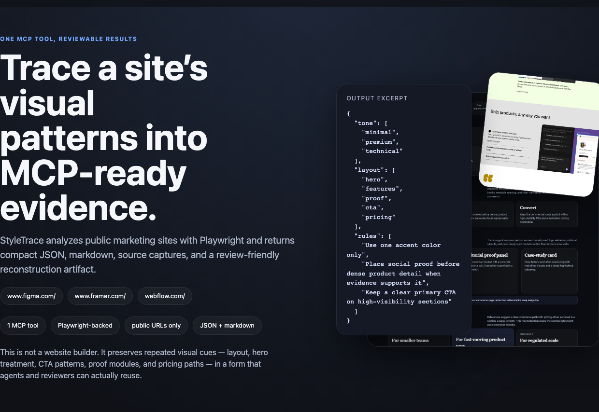

# StyleTrace


StyleTrace is an MCP server that analyzes public marketing websites and turns them into a short style summary you can reuse.



## Why use it

- compare a few reference sites and see what they really share
- turn vague style references into a structured result
- give a downstream agent or reviewer something clear to work from
- keep the output small and focused

## Installation

Requirements:

- Node.js `>=20`
- Chromium for Playwright

Setup:

```bash
npm install
npx playwright install chromium
npm run build
```

## Usage

Connect it from your MCP client:

From a local clone:

```json
{
  "mcpServers": {
    "style-trace": {
      "command": "node",
      "args": ["/absolute/path/to/style-trace/dist/src/index.js"]
    }
  }
}
```

If published to npm, users can run it directly via `npx`:

```json
{
  "mcpServers": {
    "style-trace": {
      "command": "npx",
      "args": ["-y", "style-trace"]
    }
  }
}
```

They still need Playwright Chromium installed once on the machine:

```bash
npx playwright install chromium
```

Or start the built server directly:

```bash
npm start
```

## How it works

StyleTrace visits a homepage and a few important internal pages with Playwright. It looks for repeated style patterns such as layout, CTA treatment, proof sections, pricing cues, and tone. Then it returns a compact JSON result, with an optional markdown summary.

It exposes one MCP tool: `analyze_website_style`.

## What you get

The result includes:

- analyzed pages per site
- a style profile
- evidence for the main signals
- shared patterns across sites
- guideline rules
- an optional markdown summary

## Limits

- public `http` and `https` URLs only
- no auth flows or private-network targets
- max 5 analyzed pages per site
- stdio transport only
- no persistence, queues, or web UI

## Verification

Fast local check:

```bash
npm run test:mcp-cli
```

Or run it on your own public URLs:

```bash
bash scripts/test-mcp-cli.sh https://www.apple.com/ca/store https://store.google.com/category/phones?hl=en-GB&pli=1
```

## Contributing

Contributions are welcome. Keep the project narrow, evidence-first, and easy to review.

Before opening a pull request, run:

```bash
npm run typecheck
npm run build
npm test
```

## License

This repository does not currently include a license file.
